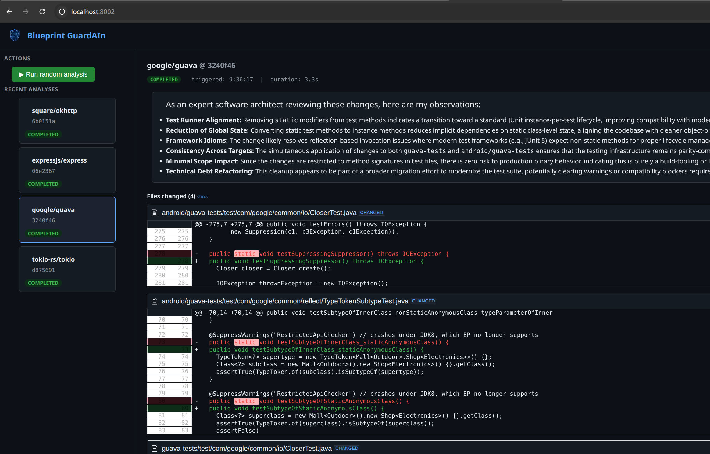
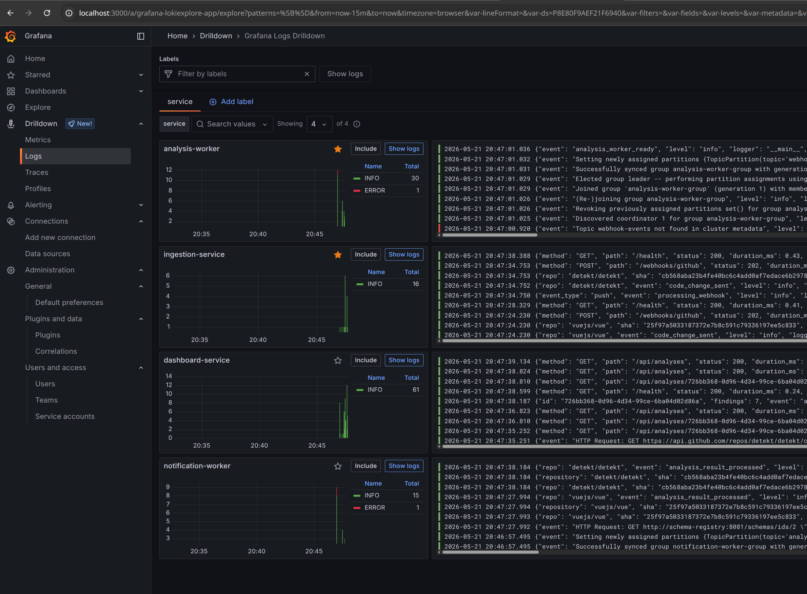
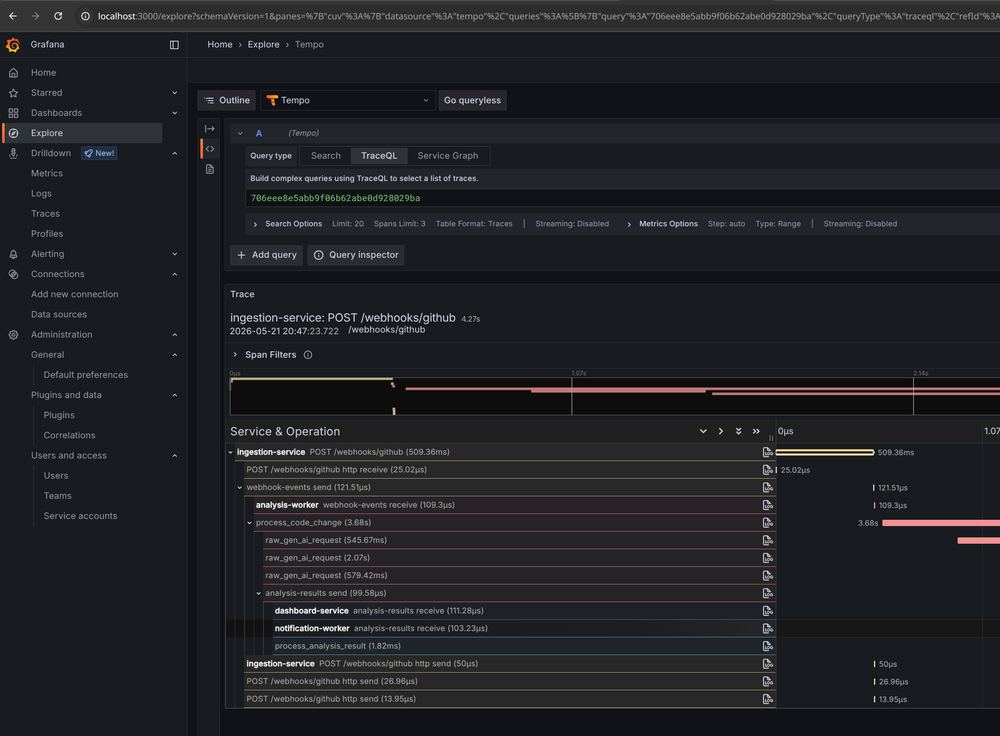

<p align="center">
    <a href="https://github.com/pakitoh/blueprintGuarAIn">
        
    </a>
</p>
<p align="center" style="color:rgb(40,82,100);font-size:44px;font-weight:bold;">
    <span style="color:rgb(23,47,88)">Blueprint</span> Guard<span style="color:white">AI</span>n
</p>

# 🛡️ Description

**Blueprint GuardAIn** is an autonomous codebase intelligence platform that acts as an AI-driven peer reviewer inside your CI/CD pipeline. It receives GitHub webhooks, analyzes code changes using LLMs, and posts architectural feedback back to PRs and Slack — all without blocking the webhook response.



---

## 🤖 AI Design

### LLM-Powered

The core of the platform is an LLM analysis loop built on [LiteLLM](https://github.com/BerriAI/litellm), which provides a unified interface to multiple LLM providers.

Each analysis prompt is structured in three steps:

1. **Context extraction** — changed files, commit messages, and branch are parsed from the webhook payload.
2. **RAG augmentation** — similar past findings are retrieved from the knowledge base and injected as examples (see below).
3. **Response parsing** — the LLM output is normalised into a clean list of architectural observations, stripping bullet and numbering markers.

### RAG Knowledge Base

Analysis quality improves over time through a **Retrieval-Augmented Generation** loop backed by **PostgreSQL + pgvector**:

- After each successful analysis, the findings are stored alongside a vector embedding of the code change.
- Before each new analysis, the top-3 most semantically similar past findings are retrieved and injected into the prompt as architectural reference.

**Repo-agnostic embeddings:** The embedding text is normalised to strip repository names and full paths, keeping only filenames and recognised architectural layer segments (`domain`, `use_cases`, etc.). This means a finding about a Kafka consumer in `service-A` can inform the analysis of an equivalent change in `service-B`, enabling cross-project knowledge transfer.

**Embedder port for swappability:** Embeddings are produced via a `LiteLLMEmbedder` adapter that calls Google's `text-embedding-004` but the `Embedder` port keeps the door open to swap in a different one or even a local model (e.g. `sentence-transformers`).

**Resilience:** If the vector store is unavailable, the analysis still runs — the RAG context is silently omitted and a warning is logged. Failures in saving new findings after analysis are also non-blocking.

### LLM Resilience

The analysis worker uses [LiteLLM Router](https://docs.litellm.ai/docs/routing) to handle failures gracefully across three layers:

| Error | Handler |
| :--- | :--- |
| 429 quota exhaustion | Router fallback — automatically retries against the next configured model/key |
| 503 / timeout / network | Tenacity retry — up to 3 attempts on the same model with exponential backoff |
| Sustained failures | Circuit breaker — opens after 5 failures, rejects calls for 60 s before retrying |

Both LLM and embedding models are configured as ordered lists in `ANALYSIS_LLM_CONFIGS` and `ANALYSIS_EMBEDDING_CONFIGS`. The first entry is the primary; the rest are fallbacks tried in order on quota exhaustion. This is **not** round-robin — every request starts at the primary and only moves to a fallback when the previous one is rate-limited.

Each entry can use a completely different provider (e.g. Gemini as primary, Groq as fallback), since each carries its own model name and API key independently.

### Seed Knowledge

The knowledge base can be pre-populated with curated architectural rules via `scripts/seed_findings.py`. This avoids a cold-start problem: the system provides useful feedback from day one, without needing to accumulate a history of real code changes first. The seed set covers common DDD/hexagonal patterns (port definitions, use case isolation, Kafka adapter responsibilities, trace propagation).

---

## ⚙️ How It Works

```
GitHub Webhook
     │
     ▼
┌──────────────────┐    Kafka (Avro)    ┌─────────────────────┐    Kafka (Avro)    ┌──────────────────────┐
│ ingestion-service│ ──────────────────▶│  analysis-worker    │ ──────────────────▶│ notification-worker  │
│  FastAPI gateway │                    │  LLM + RAG + pgvec  │          |         │   GitHub / Slack     │
└──────────────────┘                    └─────────────────────┘          |         └──────────────────────┘
                                                                         │
                                                                         │
                                                                         ▼
                                                               ┌─────────────────────┐
                                                               │  dashboard-service  │
                                                               │  FastAPI + Web UI   │
                                                               │  PostgreSQL         │
                                                               └─────────────────────┘
```

Four independent Python microservices communicate via **Kafka** using Avro-serialized messages:

- **`ingestion-service/`** — validates GitHub webhook signatures, produces `CodeChange` events.
- **`analysis-worker/`** — consumes events, runs LLM+RAG analysis, publishes `AnalysisResult` events.
- **`notification-worker/`** — consumes results, posts comments to GitHub PRs and Slack.
- **`dashboard-service/`** — consumes results, persists them to PostgreSQL, and serves a web UI to trigger analyses and inspect findings.

---

## 📡 Observability

Trace context is propagated across Kafka boundaries using **W3C `traceparent` headers**, so a single trace ID links the GitHub webhook all the way through to the GitHub PR comment. Every log entry carries `trace_id` and `span_id` via `LoggingInstrumentor`. In Grafana you can jump from a log line directly to the full trace in Tempo.

| Pillar | Tool |
| :--- | :--- |
| Traces | Tempo |
| Metrics | Prometheus |
| Logs | Loki (JSON, all libraries) |

<p align="center">
    
    
</p>


---

## 🚀 Getting Started

**Prerequisites:** Python 3.12+, Docker & Docker Compose, `uv`, LLM API key.

### Configuration

Before running the stack, fill in the required variables in the root `.env` file:

| Variable | Required | Description |
| :--- | :---: | :--- |
| `ANALYSIS_LLM_CONFIGS` | ✅ | LLM models + keys (see below) |
| `ANALYSIS_EMBEDDING_CONFIGS` | ✅ | Embedding models + keys (see below) |
| `ANALYSIS_GITHUB_TOKEN` | ✅ | GitHub token for fetching PR diffs |
| `DASHBOARD_GITHUB_TOKEN` | ✅ | GitHub token used by the dashboard |
| `NOTIFICATION_GITHUB_TOKEN` | ☐ | GitHub token for posting PR comments |
| `NOTIFICATION_SLACK_WEBHOOK_URL` | ☐ | Slack webhook for analysis notifications |

#### LLM and embedding config format

Both variables accept a JSON array of `{"model": "...", "api_key": "..."}` objects. The first entry is the **primary**; any additional entries are **automatic fallbacks** tried in order when the previous one exhausts its quota. Multi-line format is supported:

```
ANALYSIS_LLM_CONFIGS='[
  {"model": "gemini/gemini-2.0-flash",       "api_key": "your-gemini-key"},
  {"model": "groq/llama-3.3-70b-versatile",  "api_key": "your-groq-key"}
]'

ANALYSIS_EMBEDDING_CONFIGS='[
  {"model": "gemini/gemini-embedding-2", "api_key": "your-gemini-key"}
]'
```

Any [LiteLLM-supported provider](https://docs.litellm.ai/docs/providers) works — mix providers freely across primary and fallback entries.

---

### Run with Docker (recommended)

```bash
make start
```

That's it. Opens the dashboard at http://localhost:8002.

### Run locally (for development)

```bash
make dev
```

Then start each service in its own terminal:

```bash
cd ingestion-service   && uv run python -m src.main
cd analysis-worker     && uv run python -m src.main
cd notification-worker && uv run python -m src.main
cd dashboard-service   && uv run python -m src.main
```

### Individual steps

Run `make help` to see all available targets. Useful when you need to rebuild a single image, restart infrastructure, or re-seed the knowledge base independently.

### Simulate a webhook

```bash
uv run scripts/simulate_webhook.py --count 1      # single event
uv run scripts/simulate_webhook.py --delay 0.5    # continuous load
```

---

## 🧪 Testing

Each service has an isolated test suite that runs without Docker. Infrastructure (Kafka, pgvector, LiteLLM) is mocked at the boundary via `conftest.py` fixtures.

```bash
cd analysis-worker && uv run python -m pytest
```

---

## 📦 Kafka Topics

| Topic | Producer | Consumer |
| :--- | :--- | :--- |
| `webhook-events` | ingestion-service | analysis-worker |
| `analysis-results` | analysis-worker | notification-worker, dashboard-service |
