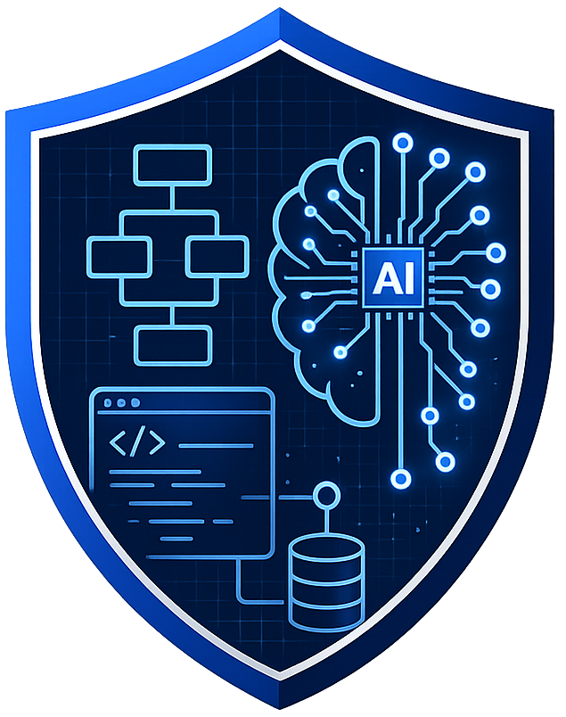

<p align="center">
    <a href="https://github.com/pakitoh/blueprintGuarAIn">
        
    </a>
</p>
<p align="center" style="color:rgb(40,82,100);font-size:44px;font-weight:bold;">
    <span style="color:rgb(23,47,88)">Blueprint</span> Guard<span style="color:white">AI</span>n
</p>

# 🛡️ Description

**Blueprint GuardAIn** is an autonomous codebase intelligence platform that acts as an AI-driven peer reviewer inside your CI/CD pipeline. It receives GitHub webhooks, analyzes code changes using LLMs, and posts architectural feedback back to PRs and Slack — all without blocking the webhook response.

---

## 🤖 AI Design

### LLM-Powered Architectural Review

The core of the platform is an LLM analysis loop built on [LiteLLM](https://github.com/BerriAI/litellm), which provides a unified interface to multiple LLM providers. The default model is **Gemini 2.5 Flash** via Google AI Studio, chosen for its large context window and low latency on code-heavy prompts.

Each analysis prompt is structured in three steps:

1. **Context extraction** — changed files, commit messages, and branch are parsed from the webhook payload.
2. **RAG augmentation** — similar past findings are retrieved from the knowledge base and injected as examples (see below).
3. **Response parsing** — the LLM output is normalised into a clean list of architectural observations, stripping bullet and numbering markers.

The analyzer is injected via a `CodeAnalyzer` port (abstract base class), so the LLM backend can be swapped or mocked without touching application logic.

### RAG Knowledge Base (pgvector)

Analysis quality improves over time through a **Retrieval-Augmented Generation** loop backed by **PostgreSQL + pgvector**:

- After each successful analysis, the findings are stored alongside a vector embedding of the code change.
- Before each new analysis, the top-3 most semantically similar past findings are retrieved and injected into the prompt as architectural reference.

**Key design decision — repo-agnostic embeddings:** The embedding text is normalised to strip repository names and full paths, keeping only filenames and recognised architectural layer segments (`domain`, `kafka`, `use_cases`, etc.). This means a finding about a Kafka consumer in `service-A` can inform the analysis of an equivalent change in `service-B`, enabling cross-project knowledge transfer.

**Embedder port for swappability:** Embeddings are produced via a `LiteLLMEmbedder` adapter that calls Google's `text-embedding-004` (768 dimensions) using the same API key as the LLM. The `Embedder` port (ABC) keeps the door open to swap in a local model (e.g. `sentence-transformers`) without changing any application code.

**Resilience:** If the vector store is unavailable, the analysis still runs — the RAG context is silently omitted and a warning is logged. Failures in saving new findings after analysis are also non-blocking.

### Seed Knowledge

The knowledge base can be pre-populated with curated architectural rules via `scripts/seed_findings.py`. This avoids a cold-start problem: the system provides useful feedback from day one, without needing to accumulate a history of real code changes first. The seed set covers common DDD/hexagonal patterns (port definitions, use case isolation, Kafka adapter responsibilities, trace propagation).

---

## ⚙️ How It Works

```
GitHub Webhook
     │
     ▼
┌──────────────────┐    Kafka (Avro)    ┌─────────────────────┐    Kafka (Avro)    ┌────────────────┐
│ ingestion-service│ ──────────────────▶│  analysis-worker    │ ──────────────────▶│ action-worker  │
│  FastAPI gateway │                    │  LLM + RAG + pgvec  │                    │ GitHub / Slack │
└──────────────────┘                    └─────────────────────┘                    └────────────────┘
```

Three independent Python microservices communicate via **Kafka** using Avro-serialized messages:

- **`ingestion-service/`** — validates GitHub webhook signatures, produces `CodeChange` events.
- **`analysis-worker/`** — consumes events, runs LLM+RAG analysis, publishes `AnalysisResult` events.
- **`action-worker/`** — consumes results, posts comments to GitHub PRs and Slack.

---

## 📡 Observability

Trace context is propagated across Kafka boundaries using **W3C `traceparent` headers**, so a single trace ID links the GitHub webhook all the way through to the GitHub PR comment. This required manually calling `propagate.extract()` and `otel_context.attach()` inside the Kafka consumer generator — the `AIOKafkaInstrumentor` creates its receive span inside `__anext__`, which ends before the loop body runs, so automatic propagation does not work across the async generator boundary.

Every log entry carries `trace_id` and `span_id` via `LoggingInstrumentor`. In Grafana you can jump from a log line directly to the full trace in Tempo.

| Pillar | Tool |
| :--- | :--- |
| Traces | Tempo |
| Metrics | Prometheus |
| Logs | Loki (JSON, all libraries) |

---

## 🚀 Getting Started

**Prerequisites:** Python 3.12+, Docker & Docker Compose, Google AI Studio API key.

```bash
# 1. Start infrastructure (Kafka, PostgreSQL/pgvector, OTEL stack)
docker-compose up -d

# 2. Install dependencies for each service
cd ingestion-service && uv sync
cd ../analysis-worker  && uv sync
cd ../action-worker    && uv sync

# 3. Seed the knowledge base (optional but recommended)
cd analysis-worker && uv run python scripts/seed_findings.py

# 4. Run the three services (one terminal each)
cd ingestion-service && uv run python -m src.main
cd analysis-worker   && uv run python -m src.main
cd action-worker     && uv run python -m src.main
```

### Simulate a webhook

```bash
uv run scripts/simulate_webhook.py --count 1      # single event
uv run scripts/simulate_webhook.py --delay 0.5    # continuous load
```

---

## 🧪 Testing

Each service has an isolated test suite that runs without Docker. Infrastructure (Kafka, pgvector, LiteLLM) is mocked at the boundary via `conftest.py` fixtures.

```bash
cd analysis-worker && uv run python -m pytest
```

---

## 📦 Kafka Topics

| Topic | Producer | Consumer |
| :--- | :--- | :--- |
| `webhook-events` | ingestion-service | analysis-worker |
| `analysis-results` | analysis-worker | action-worker |
